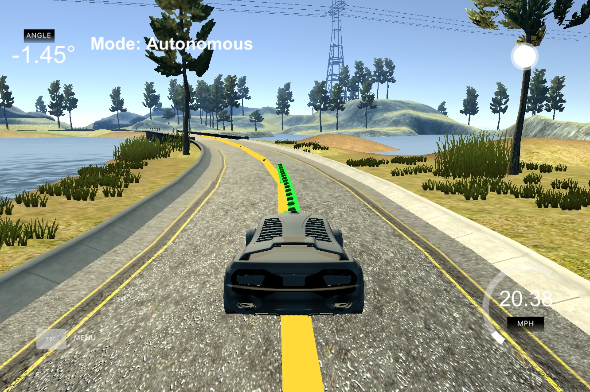

# Model Predictive Controller




Skills
---
* Control Systems
  * Model Predictive Control
* C++ 


Overview
---

This project implements a model predictive controller to optimally steer a car in accordance with pre determined waypoints. A kinematic model is used to project a cars position over a defined horizon based on current state and actuation inputs. An optimizer (Ipopt) is then used to determine the actuations at each time step to minimize the cost function. The cost function includes state errors as well as terms to minimize absolute and relative actuation. The initial actuation is forwarded to the simulator and the control loop begins again. 

This project was completed as an assignment for Udacity's Self Driving Car Nano Degree [](http://www.udacity.com/drive).

This project began with the starter code provided [here](https://github.com/udacity/CarND-MPC-Project.git)


Contents and Code Structure
---

* /src/main
    * Interacts with simulator,  calls MPC object.  
* /src/MPC
    * Defines controller object and member functions for implementing model predictive control. Header file contains critical hyperparameters
* DATA
    * Describes the JSON object send back from the simulator command server
* lake_track_waypoints
    * CSV file containing waypoints for the track in the simulator. These, along with positional data, are inputs to the MPC object functions
* t2p5 writeup
    * PDF containing more detailed outline of the MPC algorithm 


Dependencies
---

* Udacity Term 2 Simulator, which can be downloaded [here](https://github.com/udacity/self-driving-car-sim/releases)
* uWebSocketIO
    * To accomplish this (and all dependencies) I used the Udacity Docker image on Windows. Instructions for how to do that can be found [here](https://discussions.udacity.com/t/getting-started-with-docker-and-windows-for-the-ekf-project-a-guide/320236)
        * For security reasons, the VM does not automatically open port forwarding, so you need to manually enable port 4567. This is needed for the C++ program to successfully connect to the host simulator.
      1. Port Forwarding Instructions
      2. First open up Oracle VM VirtualBox
      3. Click on the default session and select settings.
      4. Click on Network, and then Advanced.
      5. Click on Port Forwarding
      6. Click on the green plus, adds new port forwarding rule.
      7. Add a rule that assigns 4567 as both the host port and guest Port, as in the screenshot.


Build Instructions
---

As long as all dependencies are satisfied, the main program can be built and run by doing the following from the project top directory.

1. mkdir build
2. cd build
3. cmake ..
4. make
5. ./mpc


Other Dependencies (if not using Docker Image)
---

* cmake >= 3.5
 * All OSes: [click here for installation instructions](https://cmake.org/install/)
* make >= 4.1(mac, linux), 3.81(Windows)
  * Linux: make is installed by default on most Linux distros
  * Mac: [install Xcode command line tools to get make](https://developer.apple.com/xcode/features/)
  * Windows: [Click here for installation instructions](http://gnuwin32.sourceforge.net/packages/make.htm)
* gcc/g++ >= 5.4
  * Linux: gcc / g++ is installed by default on most Linux distros
  * Mac: same deal as make - [install Xcode command line tools]((https://developer.apple.com/xcode/features/)
  * Windows: recommend using [MinGW](http://www.mingw.org/)
* [uWebSockets](https://github.com/uWebSockets/uWebSockets)
  * Run either `install-mac.sh` or `install-ubuntu.sh`.
  * If you install from source, checkout to commit `e94b6e1`, i.e.
    ```
    git clone https://github.com/uWebSockets/uWebSockets
    cd uWebSockets
    git checkout e94b6e1
    ```
    Some function signatures have changed in v0.14.x. See [this PR](https://github.com/udacity/CarND-MPC-Project/pull/3) for more details.

* **Ipopt and CppAD:** Please refer to [this document](https://github.com/udacity/CarND-MPC-Project/blob/master/install_Ipopt_CppAD.md) for installation instructions.
* [Eigen](http://eigen.tuxfamily.org/index.php?title=Main_Page). This is already part of the repo so you shouldn't have to worry about it.
* Simulator. You can download these from the [releases tab](https://github.com/udacity/self-driving-car-sim/releases).
* Not a dependency but read the [DATA.md](./DATA.md) for a description of the data sent back from the simulator.
